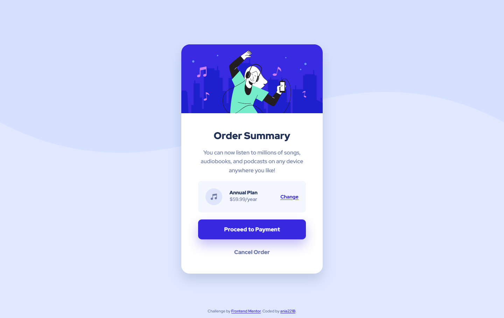

# Frontend Mentor - Order summary card solution

This is a solution to the [Order summary card challenge on Frontend Mentor](https://www.frontendmentor.io/challenges/order-summary-component-QlPmajDUj). Frontend Mentor challenges help you improve your coding skills by building realistic projects. 

## Table of contents

- [Overview](#overview)
  - [The challenge](#the-challenge)
  - [Screenshot](#screenshot)
  - [Links](#links)
- [My process](#my-process)
  - [Built with](#built-with)
- [Author](#author)
- [Acknowledgments](#acknowledgments)

## Overview

### The challenge

Users should be able to:

- See hover states for interactive elements

### Screenshot

### Links

- Solution URL: [GitHub](https://github.com/ania221B/order-summary-frontend-mentor)
- Live Site URL: [GitHub Pages](https://ania221b.github.io/order-summary-frontend-mentor/)

## My process

### Built with

- Semantic HTML5 markup
- CSS custom properties
- Flexbox
- CSS Grid
- Mobile-first workflow

## Author

- Frontend Mentor - [@ania221B](https://www.frontendmentor.io/profile/ania221B)

## Acknowledgments

[A look at the CUBE CSS methodology in action](https://www.youtube.com/watch?v=NanhQvnvbR8) - this video shows how to build the card from the challenge. I watched it after completing the challenge to compare results and made some changes based on it.
