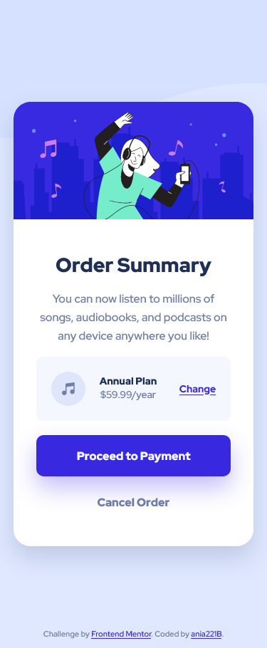

# Frontend Mentor - Order summary card solution (extended version)

This is a modified solution to the [Order summary card challenge on Frontend Mentor](https://www.frontendmentor.io/challenges/order-summary-component-QlPmajDUj). Frontend Mentor challenges help you improve your coding skills by building realistic projects. The original challenge focused on building an order summary card. This version expands on the base project by adding new elements and including unit tests.

## Table of contents

- [Overview](#overview)
  - [The challenge](#the-challenge)
  - [Modifications](#modifications)
  - [Screenshots](#screenshots)
  - [Links](#links)
- [My process](#my-process)
  - [Built with](#built-with)
  - [Testing](#testing)
- [Author](#author)
- [Acknowledgments](#acknowledgments)

## Overview

### The challenge

Users should be able to:

- Navigate through an interactive multi-step subscription process:
  - Choose a subscription plan
  - Confirm their choice
  - Enter payment details and see indication of issues if any
  - See confirmation or cancellation screens
- Get a responsive layout
- See hover states for interactive elements

### Modifications

This project builds on the original challenge by adding:

1. A multi-step subscription flow:

- Subscription selection
- Payment form with validation
- Confirmation and cancelation screens

2. Unit tests:

- Functionality tests for form validation, date handling and DOM interactions
- Tested edge cases for date validation and form inputs
- Achieving about 95% code coverage using Jest

3. Improved code structure (in comparison to previous solution):

- Main logic (main.js) is separate form utility funtions (utils.js) and an added polyfill (polyfill.js)
- Utility functions for reusable logic

### Screenshots

Original version:



Modified version:

Main screen:


Payment form validation:


### Links

- Solution URL: [GitHub](https://github.com/ania221B/order-summary-frontend-mentor)
- Live Site URL: [GitHub Pages](https://ania221b.github.io/order-summary-frontend-mentor/)

## My process

### Built with

- Semantic HTML5 markup
- CSS custom properties
- Flexbox
- CSS Grid
- JavaScript
- Jest for unit testing
- Mobile-first workflow

### Testing

This project includes unit tests for core functionality. Key areas tested include:

- Date validation logic (e.g., checking expiration date of payment card provided)
- Subscription plan selection
- Form validation for payment details (card number, name on card, expiry date, CVV)
- DOM manipulation functions

Coverage report

```
Statements   : 94.04%
Branches     : 88%
Functions    : 95%
Lines        : 95.13%
```

## Author

- Frontend Mentor - [@ania221B](https://www.frontendmentor.io/profile/ania221B)
- LinkedIn - [@anna-buwaj](https://www.linkedin.com/in/anna-buwaj/)

## Acknowledgments

- [A look at the CUBE CSS methodology in action](https://www.youtube.com/watch?v=NanhQvnvbR8) - this video shows how to build the card from the challenge. I watched it after completing the challenge to compare results and made some changes based on it.
- [Order summary card challenge on Frontend Mentor](https://www.frontendmentor.io/challenges/order-summary-component-QlPmajDUj) is the base of this project
